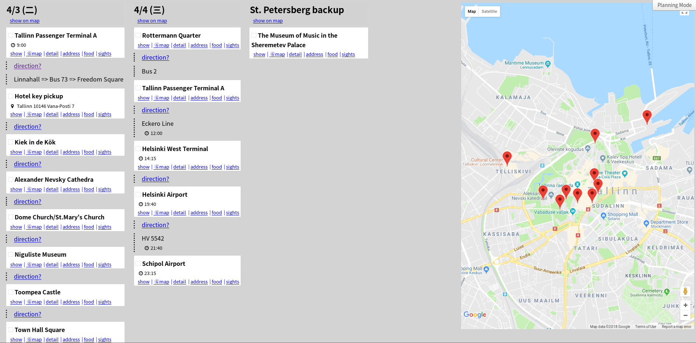

# Itinerary Viewer

A web-based trip planner, write your plan in YAML and have a nice looking printable itinerary.

## Demo:
* [Demo (Planning Mode)](https://shinglyu.github.io/itinerary-viewer/?planningMode=1)
* [Printable PDF](https://shinglyu.github.io/itinerary-viewer/demo_itinerary.pdf)

## Features
* Easy to edit, write in YAML
* Optimized for printing, with note-taking area
* Search for traffic routes between destinations
* For each point of interest
  * Search on map
  * Search details, address, foods and sights nearby (using Google)
* Maps for each day (disabled by default, Google API is expensive :P)
* Maps for each location (disabled by default)

## Additional Tools
Besides the web-based planner, this tool also comes with a set of useful scripts:

* `utils/clustering`: Tells you which attractions are nearby and should be planned together
* `util/kml`: Given a list of destinations, generate a KML file to import into map apps like Google My Map or MAPS.ME
* `util/flight_parser`: transform the flight itinerary email into itinerary-viewer compatible format.

## How to use locally

* Prerequisite: Node.js, NPM, Bower
* Run `./bin/install.sh`
* If node, npm or bower is not installed, uncomment the lines in `./bin/install.sh`
* Run with `./bin/itinerary-viewer <path/to/file.yml>`

# Tests
* Install yarn:

        curl -sS https://dl.yarnpkg.com/debian/pubkey.gpg | sudo apt-key add -
        echo "deb https://dl.yarnpkg.com/debian/ stable main" | sudo tee /etc/apt/sources.list.d/yarn.list
        sudo apt-get update
        sudo apt-get install yarn

* Install jest and other testing libraries
